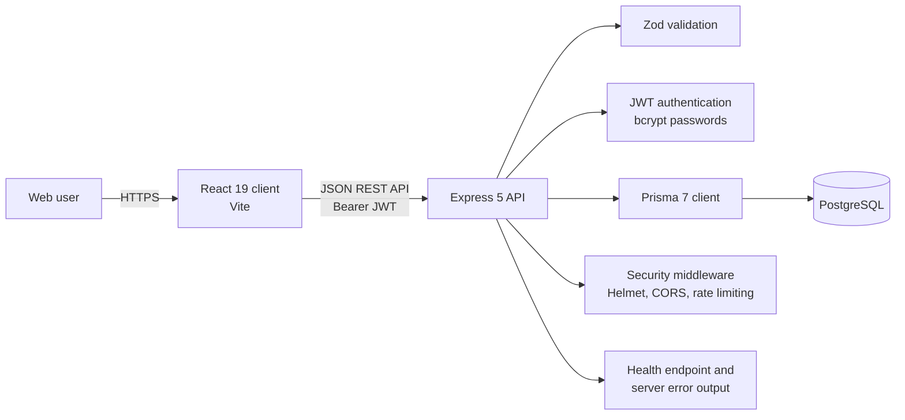
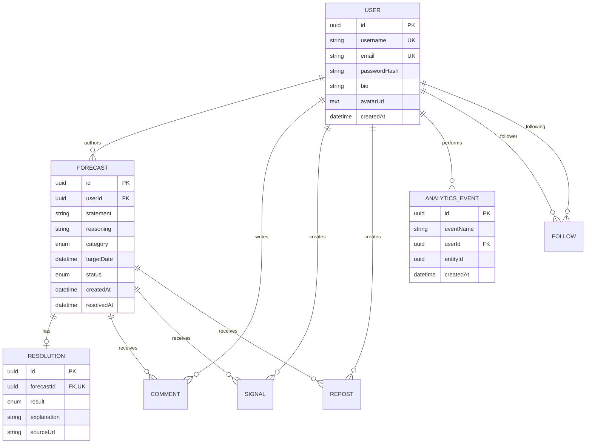
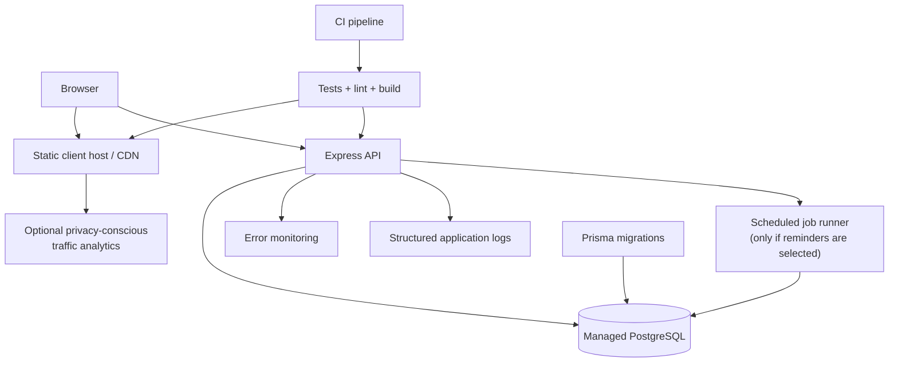

# Forekast Technical Architecture

## Architecture principles

1. Keep the system a modular monolith until scale or team boundaries justify
   separation.
2. Treat PostgreSQL as the source of truth for accounts, predictions, social
   relationships, outcomes, and product events.
3. Enforce authorization, validation, and important analytics on the server.
4. Keep prediction resolution and its dependent writes transactional.
5. Collect the minimum analytics data needed to answer product questions.
6. Add operational complexity only after a measured need appears.

## Current system



### Client

- React single-page application built with Vite
- `App.jsx` currently owns API calls, authentication state, navigation, modal
  state, and orchestration
- `FeedPage.jsx` renders the timeline, filters, and prediction interactions
- `ProfilePage.jsx` renders public profiles, accuracy, and follow behavior
- JWT and current-user data persist in browser storage
- `VITE_API_URL` selects the deployed API; local fallback is
  `http://localhost:5001/api`

### API

- Express application with JSON requests capped at 256 KB
- `auth.routes.js`: registration and login
- `forecasts.routes.js`: public/following feeds, prediction detail, creation,
  deletion, resolution, comments, signals, and reposts
- `users.routes.js`: profile reads/updates and follow/unfollow
- Zod schemas reject invalid requests before database work
- Required and optional JWT middleware provide route-level identity
- Authentication endpoints are rate-limited
- Helmet, explicit CORS, consistent 404s, and generic server errors reduce
  accidental information exposure

### Data



`Forecast` maps to the existing `tweets` table and `Signal` maps to `likes`.
These compatibility names should not be renamed during the beta unless a
migration is worth the operational risk.

### Analytics boundary

Allowed event data is deliberately narrow:

- Event name from a server allowlist
- Optional user ID
- Optional related-entity ID
- Server timestamp

Never write email addresses, prediction or comment content, passwords, JWTs, or
request bodies into analytics. Account totals come from `users`; active-user
counts come from distinct event users over a stated period; page traffic, if
added, comes from a separate traffic analytics product.

## Target architecture through beta 2

The target remains one deployable client, one deployable API, and one
PostgreSQL database.



### Near-term code boundaries

As features grow, refactor without changing deployment topology:

```text
client/src/
  api/             API client and token-aware request wrapper
  components/      Reusable prediction, profile, form, and state components
  features/
    auth/
    feed/
    forecasts/
    profiles/
  pages/

server/
  routes/          HTTP parsing and response mapping
  services/        Product rules and transaction boundaries
  repositories/    Prisma queries when query complexity warrants it
  middleware/      Authentication, validation, errors, rate limits
  analytics/       Event vocabulary and recording
```

This is an incremental direction, not a requirement to reorganize working code
before the first beta.

## Key request flows

### Create a prediction

1. Client validates basic form completeness.
2. API authenticates the JWT and validates the body with Zod.
3. A database transaction creates the prediction and
   `prediction_created` event.
4. API returns the created prediction.
5. Client inserts it into the current feed or refreshes the relevant view.

### Resolve a prediction

1. API verifies the prediction exists, belongs to the caller, remains open,
   and has reached its target date when one exists.
2. One transaction creates the resolution, updates prediction status and
   timestamp, and records `prediction_resolved`.
3. Profile accuracy is derived from resolved prediction states.

### Read a feed

1. Public timeline may apply category and status filters.
2. Following feed resolves followed account IDs and returns recent predictions.
3. Current implementation returns at most 50 results.
4. Milestone 3 replaces this boundary with cursor pagination if beta evidence
   supports the default engineering feature.

## Security and privacy

### Present controls

- Passwords hashed with bcrypt
- JWT expiry
- Required/optional authentication middleware
- Server-side ownership checks
- Zod input constraints
- Auth rate limiting
- Helmet, CORS allowlist, and small JSON body limit
- Password hashes excluded from responses

### Required before a public launch

- Password reset and preferably email verification
- Documented JWT secret rotation and revocation strategy
- Broader endpoint rate limits and abuse controls
- Moderation/reporting process
- Privacy policy and account/data deletion procedure
- Dependency and secret scanning in CI
- Database backups with a restore test
- HTTPS-only production configuration

## Reliability and observability

### Beta baseline

- `/api/health` for deployment checks
- Consistent user-facing errors
- Backend contract tests
- Frontend lint and production build
- Transactional writes for critical multi-record operations

### Next improvements

- Structured JSON logs with request ID, route, status, duration, and error code
- Hosted frontend/backend error monitoring with release identifiers
- Database-aware readiness check separate from the lightweight liveness check
- Integration tests against an isolated PostgreSQL database
- CI gate for test, lint, build, schema validation, and migration checks
- Alerts based on sustained error rate rather than individual failures

Do not log authorization headers, cookies, passwords, request bodies, emails, or
prediction/comment content.

## Performance approach

- Measure before changing infrastructure.
- Add cursor pagination before increasing feed limits.
- Use existing category/status/created-date indexes and confirm behavior with
  PostgreSQL `EXPLAIN (ANALYZE, BUFFERS)`.
- Add search indexes only after defining search behavior and representative
  queries.
- Avoid caching personalized feeds until database query measurements show a
  need.
- Avoid a queue until work must reliably outlive an HTTP request, such as
  scheduled reminders or email delivery.

## Deployment and configuration

### Client

- Build-time `VITE_API_URL`
- Static HTTPS hosting
- Cache fingerprinted assets aggressively; do not cache the application shell
  in a way that prevents releases from loading

### API

- `DATABASE_URL`, `JWT_SECRET`, `CLIENT_URL`, and `PORT`
- Run migrations as an explicit deployment step before serving new code that
  depends on them
- Use separate development, test, and production databases

### Release sequence

1. Back up or confirm managed backup status.
2. Run automated validation.
3. Apply backward-compatible migrations.
4. Deploy the API.
5. Deploy the client.
6. Verify health, registration/login, one read, and one controlled write.
7. Confirm logs, errors, and analytics.

## Architecture decision record

| Decision | Reason | Revisit when |
|---|---|---|
| Modular monolith | Fast iteration and simple operations for one developer | Team or scaling boundaries become measurable |
| REST/JSON | Matches current client and resource-oriented flows | Real-time or multi-client needs justify change |
| PostgreSQL source of truth | Transactions, relations, and analytical queries fit the domain | No planned revisit |
| Backend product events | More trustworthy than browser-only action tracking | Keep; supplement with traffic analytics |
| Derived profile accuracy | Avoids inconsistent stored counters | Query cost becomes material |
| Cursor pagination next | Stable performance and strong engineering depth | Beta shows retention is the higher priority |

